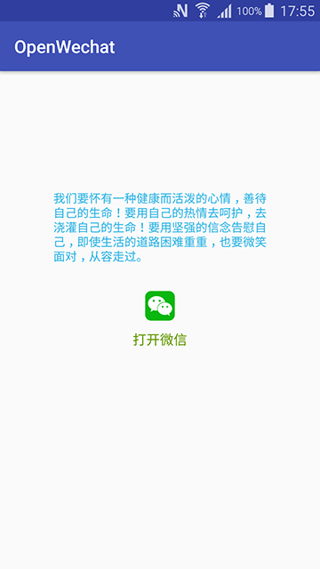

# OpenWechat

一个简单的打开微信的方式

1.将文本内容放到系统剪贴板里

  ClipboardManager cm = (ClipboardManager) getSystemService(Context.CLIPBOARD_SERVICE);
  String shareContent = "我们要怀有一种健康而活泼的心情，善待自己的生命！";
  cm.setText(shareContent);
  
2.打开微信去粘贴

  startActivity(App.getInstance().getPackageManager().getLaunchIntentForPackage("com.tencent.mm"));
        
        

